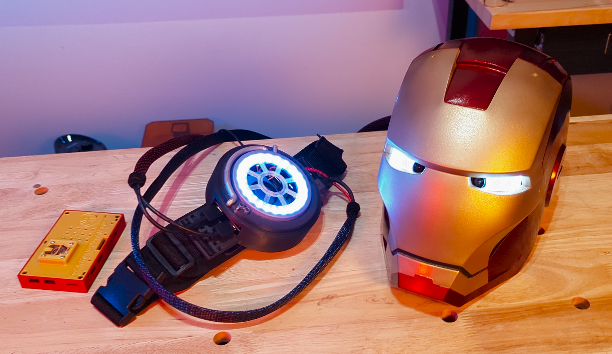
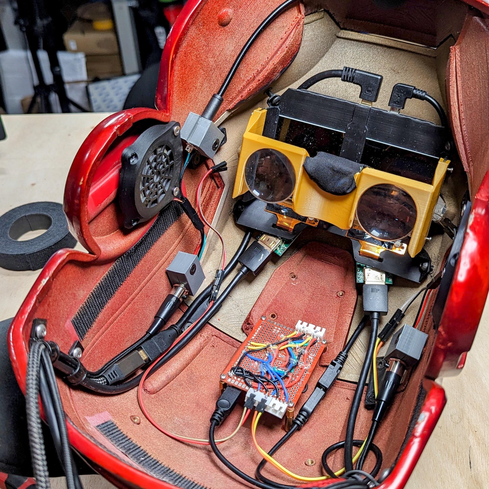
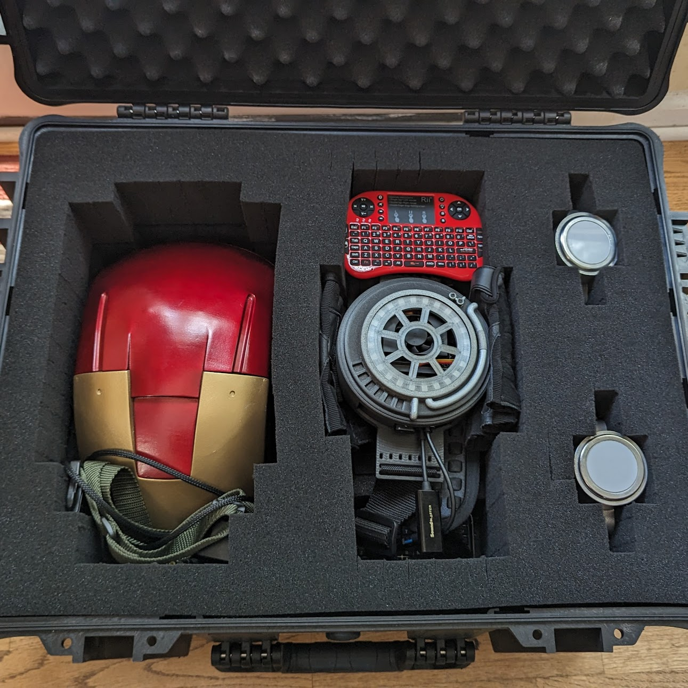

# Welcome to the O.A.S.I.S. Project

Welcome to the O.A.S.I.S. Project, where the frontier of technology blends with human creativity to redefine what's possible beyond the pages of science fiction. Standing for **Open Armor Systems Integrated Suite**, O.A.S.I.S. is at the forefront of wearable technology, drawing inspiration from iconic innovations akin to those of Tony Stark. The essence of O.A.S.I.S. lies not just in its origins within high-tech costumes but in its promise for wide-ranging applications that empower and inspire.

## Hardware Ecosystem

At the heart of the O.A.S.I.S. Project lies the *NVIDIA Jetson* platform, with current support for the **Orin Nano/NX** and the **Xavier NX**. These platforms are chosen for their computational capabilities and flexibility, designed to handle complex processing tasks effortlessly. Yet, the horizon of hardware compatibility is ever-expanding, with the **Raspberry Pi 5** next in line, promising to bring even more versatility and accessibility to the project.

## Software Foundations

The foundation of the O.A.S.I.S. Project is built upon NVIDIA's comprehensive Linux image and SDK, providing the essential tools needed for development. For instructions on how to get started, refer to the [official NVIDIA guide](https://developer.nvidia.com/embedded/learn/getting-started-jetson). Our ambition doesn't end with the present; we're also in the process of crafting a custom OS designed for embedded platforms to optimize performance and streamline operations.

## Your Pathway to Innovation

Explore the future by consulting our detailed guide, which will assist you in integrating the NVIDIA image with the O.A.S.I.S. project's core. This path is crafted for innovators and visionaries eager to make a significant impact.

Join us in this venture, where technology meets imagination, and become part of a community dedicated to pushing the boundaries of what's possible. Welcome to the O.A.S.I.S. Project—where the future is forged.

## Documentation Notes

First, thank you for your interest in the project! You are clearly a well-educated individual, as well as imaginative and forward thinking.

Next up, please keep in mind that this documentation is heavily a work in process. It is not complete. It is still evolving.

Finally, if you see something missing that you must know (or are mildly curious about), please hit me up for more info/details: [kris@kerseyfabrications.com](mailto:kris@kerseyfabrications.com)

## Where to begin?

Probably the [M.I.R.A.G.E.](mirage.md) page. It was the first part of the project and the documentation reflects that a bit. While there should be most of what you need in each project's page, not all "getting started" may be on each page.

## How to Support This Project!

Your involvement and support are crucial to the success and growth of the O.A.S.I.S. Project! Here are some ways you can help:

- **Spread the Word**: Share information about the project with friends, colleagues, and on your social media platforms. The more people know about our efforts, the greater our impact can be.

- **Give It a Try Yourself**: Download the software, experiment with it, and provide feedback. Your hands-on experience is invaluable and can help shape future developments.

- **Contribute Code, Models, Etc.**: If you're a developer, designer, or content creator, consider contributing your skills and resources. Whether it's improving the codebase, enhancing the design, or offering new models, your contributions are welcome.

- **Watch, Like, and Subscribe on YouTube**: Follow my YouTube channels, [The OASIS Project](https://www.youtube.com/@oasis-project) and [Kersey Fabrications](https://www.youtube.com/@kerseyfabs). Engage with my content by liking, commenting, and subscribing. This helps increase my visibility and reach.

- **Support Financially Through**: If you find value in what I'm creating and would like to contribute financially, consider supporting me on [Patreon](https://www.patreon.com/KerseyFabrications). Every bit helps me continue my work and keep the project moving forward.

Your support in any form makes a huge difference and is deeply appreciated!

## General Notes and Disclosures

### Indemnification

Terms of Service for all Kersey Fabrications projects: [Google Drive Link](https://drive.google.com/file/d/12SaTTdokTTmvwS61yr0HYBqnAXmNBBCp/view)

### Affiliate Links

This project, in part, is supported by affiliate links.

For Amazon Links: As an Amazon Associate I earn from qualifying purchases.

For Other Purchase Links: Other product links *may* be affiliate links that I also earn from.
